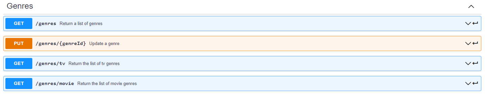

# Assignment 2 - Web API.

Name: Ben Capper

## Features.

A bullet-point list of the ADDITIONAL features you have implemented in the API **THAT WERE NOT IN THE LABS** (or modifications to existing features)

 + Swagger API Yaml File
 + Firebase Analytics Implemented
 + Full API Integration Except Must Watch
 + Extra Password Validation

## API Configuration

______________________
NODEENV=development
PORT=8080
HOST=localhost
mongoDB=YourMongoURL
seedDb=true
secret=YourJWTSecret
______________________

## API Design

Swagger Yaml file is provided in the root folder.

## Security and Authentication

All routes except login are protected. The following API endpoints are passport authenticated:

 - Movies
 - Tv
 - Company

## Integrating with React App

- All calls to the TMDB API now go through the localhost api.
- User objects contain lists of both favourite movies and favourite tv which are retrieved via api calls. 

## Independent learning (if relevant)

- Swagger yaml file layout
- Implement firebase analytics
- More complex password validation  
